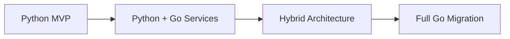
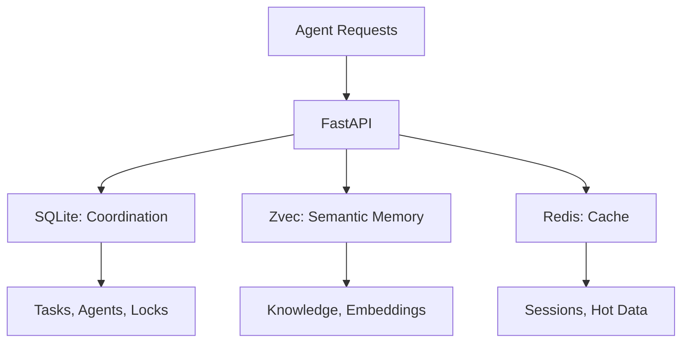
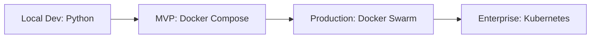
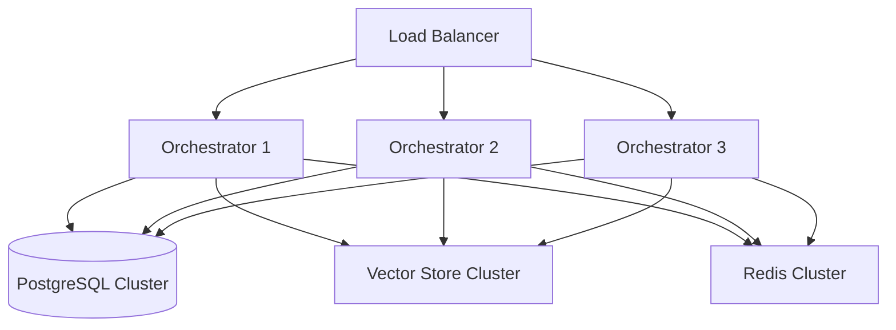

# Agent Hub Architecture Evaluation & Trade-offs

## Executive Summary

This document evaluates the architectural decisions for the Multi-Agent Coordination Hub, analyzing trade-offs, alternatives, and future scalability considerations. The system is designed to coordinate multiple AI agents (Claude Code, Cursor, Copilot, custom scripts) working on shared codebases.

## Architecture Decision Records (ADRs)

### ADR-001: Programming Language Selection

**Status**: Accepted  
**Date**: 2026-02-24

#### Context
Need to select primary programming language for the orchestrator service.

#### Decision
**Python 3.11+** chosen as primary language.

#### Rationale
| Criterion | Python | Go | Rust | Node.js | Score |
|-----------|--------|----|----- |---------|-------|
| **AI Ecosystem** | ⭐⭐⭐⭐⭐ | ⭐⭐ | ⭐⭐ | ⭐⭐⭐ | Python wins |
| **Development Speed** | ⭐⭐⭐⭐⭐ | ⭐⭐⭐ | ⭐⭐ | ⭐⭐⭐⭐ | Python wins |
| **Performance** | ⭐⭐ | ⭐⭐⭐⭐⭐ | ⭐⭐⭐⭐⭐ | ⭐⭐⭐ | Go/Rust win |
| **Concurrency** | ⭐⭐⭐ | ⭐⭐⭐⭐⭐ | ⭐⭐⭐⭐⭐ | ⭐⭐⭐⭐ | Go/Rust win |
| **Library Support** | ⭐⭐⭐⭐⭐ | ⭐⭐⭐ | ⭐⭐⭐ | ⭐⭐⭐⭐ | Python wins |

**Why Python wins overall:**
- Zvec native support
- FastAPI excellent async performance
- Agent SDKs primarily Python
- Team expertise
- Rapid prototyping capability

#### Trade-offs Accepted
- **Performance**: ~3x slower than Go/Rust for CPU-bound tasks
- **Memory Usage**: ~2x higher memory footprint
- **Concurrency**: GIL limitations (mitigated by async I/O focus)

#### Future Migration Path


---

### ADR-002: Vector Database Selection

**Status**: Accepted  
**Date**: 2026-02-24

#### Context
Need embedded vector database for agent knowledge sharing and semantic search.

#### Decision
**Zvec** (Alibaba's embedded vector DB) chosen over Chroma, Qdrant, Weaviate.

#### Comparison Matrix
| Feature | **Zvec** | Chroma | Qdrant | Weaviate |
|---------|----------|--------|--------|----------|
| **Deployment** | Embedded | Docker | Docker | Docker |
| **Performance** | 8,000+ QPS | ~3,000 QPS | ~4,000 QPS | ~2,500 QPS |
| **Memory Usage** | Low | Medium | Medium | High |
| **Setup Complexity** | `pip install` | Docker Compose | Docker Compose | Docker + Config |
| **Python Integration** | Native | HTTP API | HTTP/gRPC | GraphQL |
| **Production Ready** | ✅ (Alibaba) | ✅ | ✅ | ✅ |

#### Rationale
1. **Simplicity**: No external service required
2. **Performance**: 2x faster than alternatives
3. **Resource Efficiency**: Embedded reduces memory overhead
4. **Local Development**: Perfect for local agent coordination

#### Trade-offs Accepted
- **Language Lock-in**: Python-only (no multi-language clients yet)
- **Scalability**: Single-process limitation
- **Ecosystem**: Newer, smaller community vs Chroma

#### Mitigation Strategies
- **Hybrid Approach**: Zvec for local, Chroma for cloud deployments
- **Abstraction Layer**: Vector service interface for future swapping

---

### ADR-003: Communication Protocol

**Status**: Accepted  
**Date**: 2026-02-24

#### Context
Choose primary protocol for agent-hub communication.

#### Decision
**WebSocket-first** with REST API fallback.

#### Protocol Analysis

##### WebSocket Advantages
```javascript
// Real-time bidirectional communication
const ws = new WebSocket('ws://localhost:7788/v1/agent-connect');

// Instant task assignment
ws.onmessage = (event) => {
    const task = JSON.parse(event.data);
    if (task.type === 'task_assigned') {
        processTask(task.payload);
    }
};
```

##### REST API Limitations
```bash
# Polling required for updates
while true; do
    curl http://localhost:7788/v1/tasks/next
    sleep 5  # Polling delay
done
```

#### Performance Comparison
| Aspect | WebSocket | REST + Polling | Server-Sent Events |
|--------|-----------|-----------------|-------------------|
| **Latency** | ~10ms | ~2.5s avg | ~100ms |
| **Resource Usage** | Low | High (polling) | Medium |
| **Implementation** | Complex | Simple | Medium |
| **Browser Support** | Universal | Universal | Good |
| **Firewall Issues** | Some | None | Some |

#### Trade-offs Accepted
- **Complexity**: WebSocket state management vs stateless REST
- **Connection Management**: Persistent connections vs request-response
- **Debugging**: Harder to debug WebSocket flows

#### Hybrid Strategy
```python
# WebSocket for real-time coordination
@app.websocket("/v1/agent-connect")
async def agent_websocket(websocket: WebSocket):
    # Task assignment, status updates, notifications
    pass

# REST for heavy operations
@app.post("/v1/artifacts/upload")
async def upload_artifact(file: UploadFile):
    # File uploads, bulk operations
    pass
```

---

### ADR-004: State Management Architecture

**Status**: Accepted  
**Date**: 2026-02-24

#### Context
Design data persistence and caching strategy for multi-agent coordination.

#### Decision
**3-Tier Memory Architecture**: SQLite + Zvec + Redis



#### Component Responsibilities

##### SQLite (Coordination Layer)
```sql
-- Structured coordination data
CREATE TABLE tasks (
    id TEXT PRIMARY KEY,
    status TEXT NOT NULL,
    claimed_by TEXT,
    lease_until TIMESTAMP
);

CREATE TABLE agents (
    id TEXT PRIMARY KEY,
    capabilities JSON,
    last_heartbeat TIMESTAMP
);
```

##### Zvec (Knowledge Layer)  
```python
# Semantic memory and agent learning
zvec_collection.add({
    "id": "solution_cors_fix",
    "vector": embedding,
    "metadata": {
        "category": "solution",
        "problem": "CORS error",
        "solution": "app.add_middleware(CORSMiddleware)",
        "success_rate": 0.95,
        "agent_id": "claude-be"
    }
})
```

##### Redis (Cache Layer)
```python
# Fast session data and pubsub
redis.setex(f"agent:{agent_id}:session", 3600, session_data)
redis.publish("task_updates", {"task_id": task_id, "status": "completed"})
```

#### Alternative Architectures Considered

##### Single Database (PostgreSQL + pgvector)
**Pros**: Unified storage, ACID transactions, mature  
**Cons**: Heavy for local deployment, complex setup  
**Verdict**: Rejected for MVP, considered for enterprise

##### NoSQL (MongoDB + Vector Search)
**Pros**: Flexible schema, good scaling  
**Cons**: Complex queries, consistency issues  
**Verdict**: Rejected due to complexity

##### Pure In-Memory (Redis Only)
**Pros**: Maximum performance, simple  
**Cons**: Data loss on restart, limited persistence  
**Verdict**: Rejected due to durability requirements

#### Performance Projections
| Metric | Target | SQLite | Zvec | Redis |
|--------|--------|--------|------|--------|
| **Task Operations** | 100/sec | ✅ 500/sec | N/A | ✅ 1000/sec |
| **Vector Searches** | 50/sec | N/A | ✅ 8000/sec | N/A |
| **Cache Hits** | 200/sec | N/A | N/A | ✅ 10000/sec |

---

### ADR-005: Deployment Strategy

**Status**: Accepted  
**Date**: 2026-02-24

#### Context
Determine deployment model for local multi-agent coordination.

#### Decision
**Docker-first** with local development support.

#### Deployment Options Analysis

##### Option 1: Native Installation
```bash
# Direct installation
pip install agenthub
agenthub serve --host localhost --port 7788
```
**Pros**: Simple setup, no Docker dependency  
**Cons**: Environment conflicts, harder reproducibility

##### Option 2: Docker Single Container
```bash
# Everything in one container
docker run -p 7788:7788 agenthub:latest
```
**Pros**: Simple deployment, isolated environment  
**Cons**: Harder to scale components independently

##### Option 3: Docker Compose (Chosen)
```yaml
services:
  agenthub:
    build: .
    depends_on: [redis]
  redis:
    image: redis:7-alpine
```
**Pros**: Component isolation, easy scaling, reproducible  
**Cons**: More complexity than single container

##### Option 4: Kubernetes
```yaml
apiVersion: apps/v1
kind: Deployment
metadata:
  name: agenthub
```
**Pros**: Production-grade orchestration  
**Cons**: Overkill for local development

#### Chosen Strategy: Progressive Deployment


---

## Scalability Analysis

### Current Architecture Limits

#### Concurrent Agents
- **WebSocket Connections**: ~500 (FastAPI/Uvicorn limit)
- **Database Connections**: ~100 (SQLite connection pool)
- **Memory Usage**: ~4GB (estimated for 100 active agents)

#### Task Throughput
- **Task Creation**: 1,000/minute (database bottleneck)
- **Task Claims**: 500/minute (atomic operations)
- **Vector Searches**: 8,000/second (Zvec performance)

#### Storage Capacity
- **SQLite Database**: 281TB theoretical limit
- **Vector Embeddings**: 10M+ documents (Zvec)
- **Artifact Storage**: Limited by filesystem

### Scaling Strategies

#### Vertical Scaling (Phase 1)
```yaml
# Increase container resources
resources:
  limits:
    cpus: '4.0'
    memory: 8G
  reservations:
    cpus: '2.0'  
    memory: 4G
```

#### Horizontal Scaling (Phase 2)
```yaml
# Multiple orchestrator instances
services:
  agenthub-1:
    image: agenthub:latest
    environment:
      - INSTANCE_ID=1
  agenthub-2:
    image: agenthub:latest  
    environment:
      - INSTANCE_ID=2
  
  # Shared database
  postgres:
    image: postgres:15
    volumes:
      - postgres_data:/var/lib/postgresql/data
```

#### Distributed Architecture (Phase 3)


### Performance Bottlenecks & Solutions

#### Database Write Contention
**Problem**: SQLite single-writer limitation  
**Solution**: 
1. **Short-term**: WAL mode, optimized transactions
2. **Long-term**: PostgreSQL migration

#### Vector Search Latency  
**Problem**: Complex embeddings slow down searches  
**Solutions**:
1. **Embedding Cache**: Redis-backed LRU cache
2. **Batch Processing**: Group vector operations
3. **Index Optimization**: Regular Zvec index rebuilds

#### WebSocket Connection Limits
**Problem**: Single process WebSocket limit (~500)  
**Solutions**:
1. **Connection Pooling**: Smart connection management
2. **Process Clustering**: Multiple Uvicorn workers
3. **Message Queuing**: Redis Streams for async processing

---

## Security Architecture

### Threat Model

#### Assets to Protect
1. **Agent Coordination Data**: Task queues, agent registry
2. **Knowledge Base**: Shared agent learnings and solutions
3. **Code Artifacts**: Generated and modified code files  
4. **API Access**: Orchestrator service endpoints

#### Threat Actors
1. **Malicious Agents**: Rogue AI agents attempting to disrupt coordination
2. **External Attackers**: Network-based attacks on API endpoints
3. **Insider Threats**: Legitimate agents with elevated permissions

#### Attack Vectors
1. **API Injection**: Malicious payloads in WebSocket/REST requests
2. **Resource Exhaustion**: DoS through excessive connections/requests  
3. **Data Poisoning**: False knowledge entries to mislead other agents
4. **Privilege Escalation**: Agents attempting unauthorized operations

### Security Controls

#### Authentication & Authorization
```python
# Multi-tier API key system
API_KEY_ROLES = {
    "admin": ["*"],  # Full system access
    "agent": ["task:claim", "knowledge:share", "artifact:upload"],
    "viewer": ["read:*"]
}

# JWT for session management
JWT_SECRET = os.environ["JWT_SECRET"]
JWT_ALGORITHM = "HS256"
JWT_EXPIRY = 3600  # 1 hour
```

#### Input Validation & Sanitization
```python
# Strict input validation
class TaskCreateRequest(BaseModel):
    title: str = Field(..., max_length=200, pattern=r'^[a-zA-Z0-9\s\-_]+$')
    description: str = Field(..., max_length=5000)
    capabilities: list[str] = Field(..., max_items=10)
    
    @field_validator('capabilities')
    def validate_capabilities(cls, v):
        allowed_caps = load_capability_whitelist()
        for cap in v:
            if cap not in allowed_caps:
                raise ValueError(f"Invalid capability: {cap}")
        return v
```

#### Resource Protection
```python
# Rate limiting per agent
@limiter.limit("100/minute")
@require_auth
async def api_endpoint():
    pass

# Connection limits
MAX_CONNECTIONS_PER_AGENT = 3
CONNECTION_TIMEOUT = 300  # 5 minutes
```

---

## Monitoring & Observability

### Metrics Architecture

#### Application Metrics
```python
# Prometheus metrics
from prometheus_client import Counter, Gauge, Histogram

# Business Metrics
TASKS_COMPLETED = Counter('tasks_completed_total', 'Completed tasks', ['agent_type'])
ACTIVE_AGENTS = Gauge('active_agents', 'Currently connected agents')
TASK_DURATION = Histogram('task_duration_seconds', 'Task completion time')

# Technical Metrics  
WEBSOCKET_CONNECTIONS = Gauge('websocket_connections', 'Active WebSocket connections')
VECTOR_SEARCH_LATENCY = Histogram('vector_search_seconds', 'Vector search time')
DATABASE_QUERY_TIME = Histogram('db_query_seconds', 'Database query time')
```

#### Infrastructure Metrics
```yaml
# Docker container metrics
services:
  cadvisor:
    image: gcr.io/cadvisor/cadvisor
    ports: ["8080:8080"]
    volumes:
      - /:/rootfs:ro
      - /var/run:/var/run:ro
      - /sys:/sys:ro
      - /var/lib/docker/:/var/lib/docker:ro
```

### Logging Strategy

#### Structured Logging Format
```json
{
  "timestamp": "2026-02-24T10:30:00Z",
  "level": "INFO",
  "event": "task_claimed",
  "agent_id": "claude-fe-dev",
  "task_id": "task_12345",
  "capabilities_required": ["react", "typescript"],
  "estimated_duration": 300,
  "trace_id": "abc123def456"
}
```

#### Log Aggregation
```yaml
# ELK Stack for log aggregation
services:
  elasticsearch:
    image: elasticsearch:8.11.0
  logstash:
    image: logstash:8.11.0
  kibana:
    image: kibana:8.11.0
    ports: ["5601:5601"]
```

### Alerting Rules

#### Critical Alerts
```yaml
# Prometheus alerting rules
groups:
  - name: agenthub.critical
    rules:
      - alert: AgentHubDown
        expr: up{job="agenthub"} == 0
        for: 30s
        
      - alert: HighTaskFailureRate  
        expr: rate(tasks_failed_total[5m]) > 0.1
        for: 2m
        
      - alert: DatabaseConnectionsHigh
        expr: db_connections_active > 80
        for: 1m
```

---

## Future Evolution Path

### Phase 1: MVP (Current)
- **Timeline**: 2-3 months
- **Scope**: Local coordination for 10-50 agents
- **Tech Stack**: Python + FastAPI + SQLite + Zvec + Redis
- **Deployment**: Docker Compose

### Phase 2: Enhanced Coordination
- **Timeline**: 3-6 months  
- **Scope**: Advanced agent workflows, approval systems
- **New Features**:
  - Multi-step task workflows
  - Human-in-the-loop approvals
  - Agent performance analytics
  - Enhanced security model

### Phase 3: Scale & Performance  
- **Timeline**: 6-12 months
- **Scope**: 100+ agents, enterprise deployment
- **Migrations**:
  - PostgreSQL + pgvector (replaces SQLite + Zvec)
  - Go microservices (performance-critical paths)
  - Kubernetes deployment
  - Multi-tenant support

### Phase 4: AI-Native Features
- **Timeline**: 12+ months
- **Scope**: Intelligent coordination, self-improving agents
- **Advanced Features**:
  - Agent capability discovery
  - Automatic task decomposition  
  - Predictive resource allocation
  - Cross-codebase knowledge transfer

---

## Conclusion

The chosen architecture balances **simplicity** (for rapid development), **performance** (for real-time coordination), and **scalability** (for future growth). Key decisions favor developer experience and local deployment while maintaining clear migration paths for enterprise scaling.

### Key Strengths
1. **Rapid Development**: Python ecosystem enables fast iteration
2. **Universal Agent Support**: WebSocket protocol works across all platforms
3. **Embedded Performance**: Zvec eliminates infrastructure complexity
4. **Clear Migration Path**: Architecture supports gradual scaling

### Acknowledged Technical Debt
1. **Language Performance**: Python limitations for CPU-intensive workloads
2. **Single Database**: SQLite write bottlenecks at scale  
3. **Embedded Vector Store**: Zvec scaling limitations vs dedicated service
4. **Monolithic Design**: Single service vs microservices architecture

### Risk Mitigation
- **Performance Monitoring**: Early identification of bottlenecks
- **Abstraction Layers**: Enable component swapping without rewrite
- **Load Testing**: Validate scaling assumptions before production
- **Documentation**: Comprehensive upgrade paths for each component